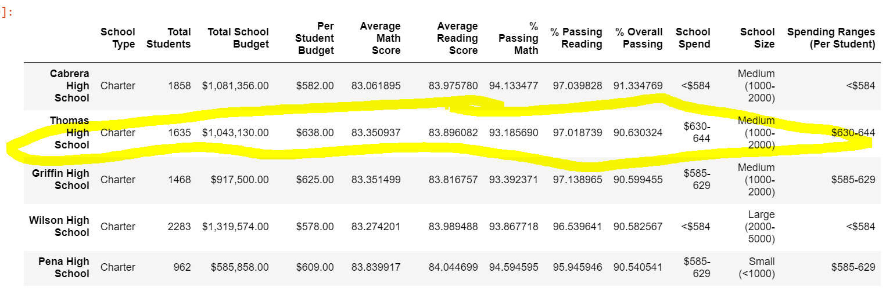

# School_District_Analysis
## Overview of the school district analysis: Explain the purpose of this analysis.
The purpose of this analysis was done after the School District discovered the grade 9 test scores at Thomas Highschool showed evidence of academic dishonesty. Therefore, the previous analysis conducted on all school districts was unfairly compared to THS 9th grade students. To resolve this, we decided to remove 9th grade test scores from THS and keep 10th-12 intact rather than removing all THS scores. In doing this, we are still able to compare THS test scores to other schools in the district while not allowing incorrect data affect any analysis results. 

## Results: Using bulleted lists and images of DataFrames as support, address the following questions.

### How is the district summary affected?
The district summary was affected because THS 9th grade students averaged higher math reading and overall passing % than the district. By removing them we were able to capture a more honest look at the districts passing %. Passing Math % decreased from 74.9% to 73.9% and Passing Reading % decreased from 85.8% to 84.7%. Overall passing also decreased from 65.17% to 64.1%. 

### How is the school summary affected?
When removing 9th graders THS school was not as affected much. When removing 9th graders scores Thomas High School remained in the top 5 schools.This is because of good performance of their other grades. Their passing % did drop a bit for each category which will be mentioned bellow. 

### How does replacing the ninth graders’ math and reading scores affect Thomas High School’s performance relative to the other schools?
It affects it slightly as THS math passing scores (83.5%) was higher than district passing math scores (78.9%) but THS 10th-12th graders also performed above average in these two categories compared to the district which still left them #2 in the top 5 schools overall passing. 

### How does replacing the ninth-grade scores affect the following:

#### Math and reading scores by grade
#### Scores by school spending
THS remained in the same School Spending bin but its % Passing did change. This did not impacting spending ranges or alter bins for math and reading scores although it did slightly affect passing percentages. Math when from 93.27% to 93.18%, reading from 97.3% to 97% and overall from 91% to 90.6%. It makes sense that removing 9th graders would not affect Scores by School spending much.

#### Scores by school size
As a whole removing 9th grader scores should only affect the bin THS was in (630-644) and it did. % Passing math went from 73% to 73.46%, % Passing Reading went from 84% to 84.3%. Other bin were unaffected as the seperation by school spending means that THS would only affect the passing % of its given bin. As you can see very small changes in the scores, as now medium ssize schools are now first in performance. 

#### Scores by school type
Similar to above, changes to school type were minimally affected by removing 9th grade scores.

## Summary: Summarize four major changes in the updated school district analysis after reading and math scores for the ninth grade at Thomas High School have been replaced with NaNs.

Removing these scores really only affected the bins that THS belonged to. As mentioned above the impacts upon each category. This meant for Charter school types the % passing math, % passing reading and % overall passing will decrease yet other values and the other type of school did not change. In addition in medium size schools the passing % for math and reading as well as overall did decrease but the other school sizes remained the same. One large insight we can see is that although the average math reading scores did not changes significantly, the math/reading/overall pacing % did change.

